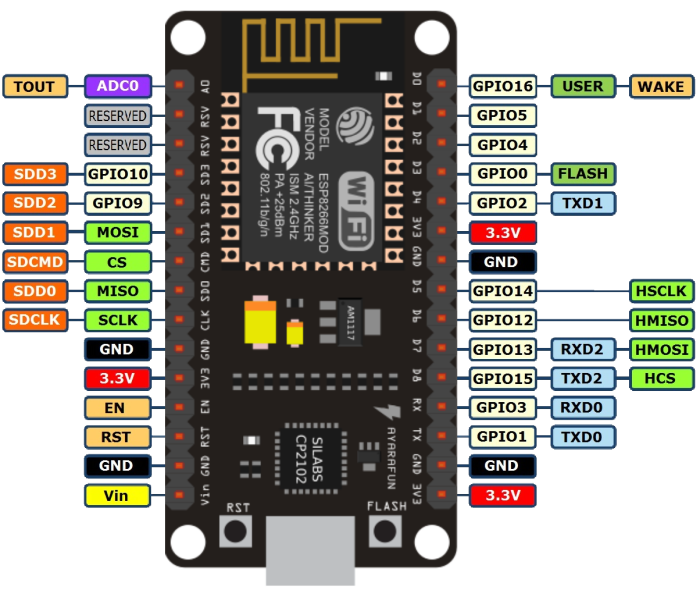

# Micro Python Experiments on ESP 8266

## Getting Started
Micropython complete documentation for ESP 8266 is available [here](https://docs.micropython.org/en/latest/esp8266/esp8266/tutorial/intro.html). This includes the details on how to flash the board, etc. 

### Connecting to the board
Using the serial REPL mode
```
picocom /dev/ttyUSB0 -b115200
```

### Sending files
```
ampy --port /dev/ttyUSB0 put neopixel_demo.py 
```

### Retrieving Files
```
ampy --port /dev/ttyUSB0 get boot.py boot.py
```


### Viewing the Files
```
import os
os.listdir()
```

### Display file contents
```
f=open('filename.py')
f.readlines()
```

## Pin Configuration
This is the map between the GPIO names in the code and the physcial connection in the node MCU board. Please note that there is a lot of mismatch and you need to ensure that the GPIO pins are matched before testing the code. 
